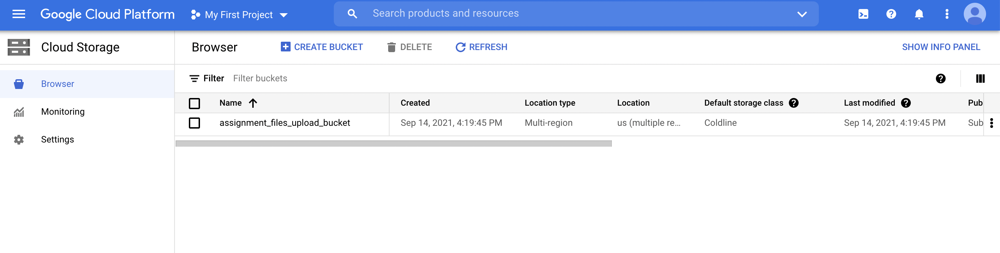

# GCP Assignment
> Writing code to do the following:
- Create a bucket in GCP cloud storage
- Upload files from the local system to the bucket
- Download files from the bucket and left join the tables
- Create a bigquery dataset, a bigquery table
- Load the data from the merged table

## Table of Contents
* [Part 1](#upload-files)
	* [Pre Requisites](#pre-requisites1)
	* [Steps](#steps1)
* [Part 2](#download-and-load-data-into-table)
	* [Pre Requisites](#pre-requisites2)
	* [Steps](#steps2)
	* [Output](#output2)
* [References](#references)

## Part 1
> Writing code to do the following:
- Create a bucket in GCP cloud storage
- Upload files from the local system to the bucket

### Pre Requisites
- Create a GCP service account
- Generate and download the credentials into a json file
- Python version 3.X
- Install the required client libraries by executing the below commands in the terminal:

`pip install google-cloud-storage`

- The Customers.csv and Orders.csv files must be placed in the below folder structure on the local system:

! [Folder Structure](./Part 1/img/FolderStrcuture.png)

### Steps
After successful execution a new bucket should be created and the files should be available as shown below:

## Part 2
> Writing code to do the following:
- Download files from the bucket and left join the tables
- Create a bigquery dataset, a bigquery table
- Load the data from the merged table

### Pre Requisite
- Install the required client libraries by executing the below commands in the terminal:

`pip install --upgrade google-auth-oauthlib`

`pip install google-cloud-bigquery`

or

`pip install --upgrade google-cloud-bigquery`

### Steps
After successful execution:
- Files should be downloaded from the cloud storage:

- New dataset, schema and table should be created:

- Data after merging the two files should be loaded into the newly created table:

### Output

## References
- [Getting started with authentication](https://cloud.google.com/docs/authentication/getting-started)
- [Authenticating as a service account](https://cloud.google.com/docs/authentication/production)
- [Authenticating as an end user](https://cloud.google.com/docs/authentication/end-user)
- [Creating storage buckets](https://cloud.google.com/storage/docs/creating-buckets)
- [Uploading objects](https://cloud.google.com/storage/docs/uploading-objects)
- [Downloading objects](https://cloud.google.com/storage/docs/downloading-objects)
- [Creating datasets](https://cloud.google.com/bigquery/docs/datasets)
- [Creating and using tables](https://cloud.google.com/bigquery/docs/tables)
- [Load data from DataFrame](https://cloud.google.com/bigquery/docs/samples/bigquery-load-table-dataframe)

